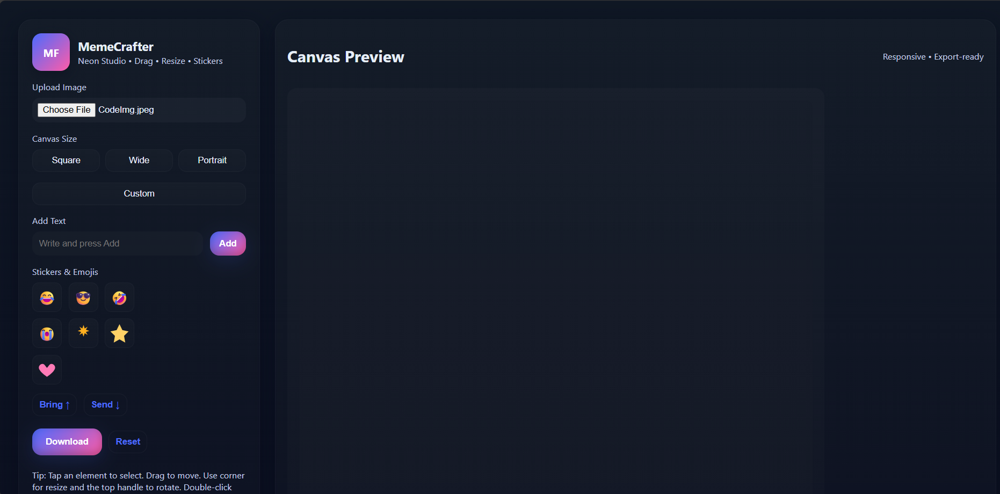
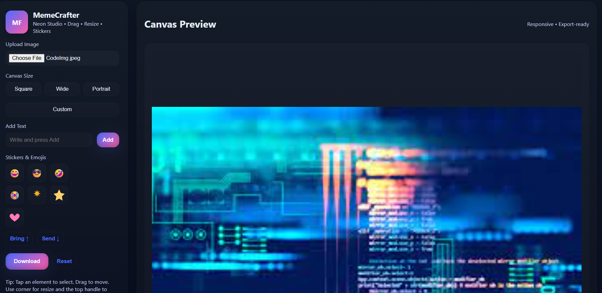
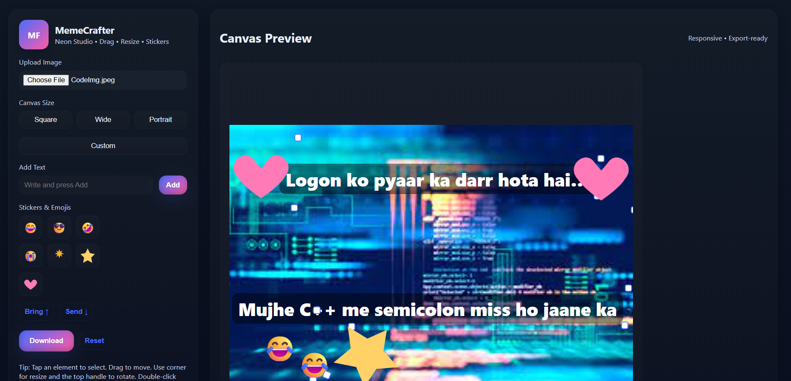
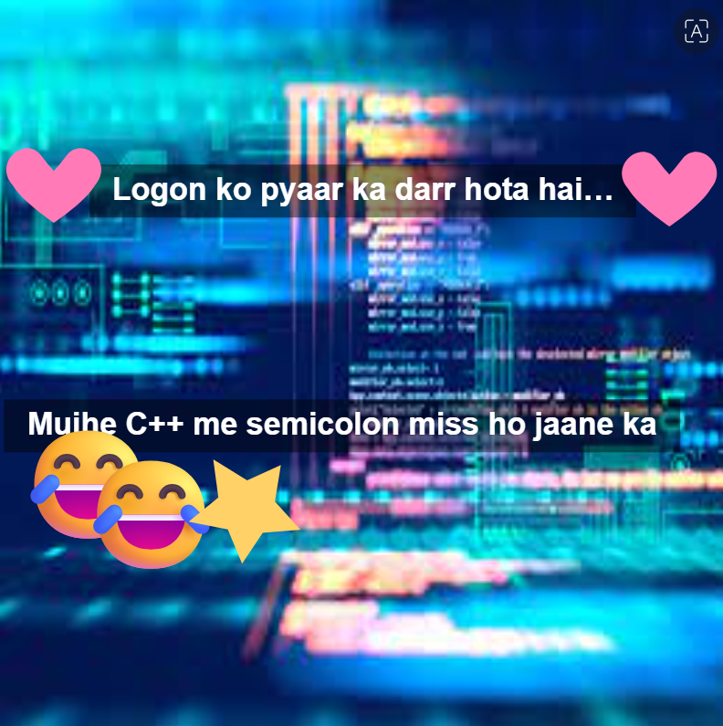

# 🎨 MemeCrafter – Neon Studio  
**Drag • Resize • Stickers • Export PNG**

MemeCrafter is a modern, neon-styled meme editor where users can upload an image, add text, emojis, stickers, rotate, resize and export clean PNG memes instantly.  
It’s fully responsive and built using **HTML, CSS, JavaScript** — no frameworks.

---
🌐 Live Demo
👉

## 🚀 Features

### 🖼️ **1. Upload any image**
- Supports all formats: JPG, PNG, JPEG  
- Image fits perfectly into canvas  
- Smooth neon UI

### ✍️ **2. Add Text**
- Bold white headings  
- Drag to move  
- Resize corners  
- Double-click to edit text  
- Rotatable text blocks  

### 🤩 **3. Stickers & Emojis**
- Funny emojis  
- Cute stickers  
- Explosion, stars, hearts  
- Draggable, resizable, rotatable  

### 🎚️ **4. Layer Control**
- Bring Forward  
- Send Back  

### 📏 **5. Custom Canvas Sizes**
- Square (1080×1080)  
- Wide (1280×720)  
- Portrait (720×1280)  
- Custom size option  

### 📥 **6. Export in High-Quality PNG**
- Final meme exported exactly as shown  
- Crisp text & emojis  
- Works on all devices

---

## 📸 Screenshots

### 🟣 Project Initial Screen

### 🟦 Square Canvas Selected

### 🟡 Editing Meme

### 💗 Final Meme Output

---

## 🛠️ Technologies Used
- **HTML5**
- **CSS3 (Neon Glassmorphism UI)**
- **Vanilla JavaScript**
- Canvas Export API

---

## 📂 Folder Structure
MemeCrafter/
 ├── asset/
 │   └── screenshots/
 │        ├── project-initial.png
 │        ├── canvas-square.png
 │        ├── meme-editing.png
 │        └── meme-output.png
 ├── css/
 ├── js/
 ├── index.html
 └── README.md

---

## 💡 How to Use
1. Open the app in your browser  
2. Upload any image  
3. Add text or stickers  
4. Drag, resize, rotate  
5. Click **Download** to save your final meme 🎉  

---

## ⭐ Future Improvements
- Dark/Light theme switch  
- Custom sticker upload  
- Text presets (outline, shadow, glow)  
- Undo / Redo system  
- Mobile gesture improvements  

---

## 👩‍💻 Developer
**Deepali Kumari**  
B.Sc CS & Data Analytics, IIT Patna  
Passionate about Web Development • UI/UX • JavaScript • ML  

---

